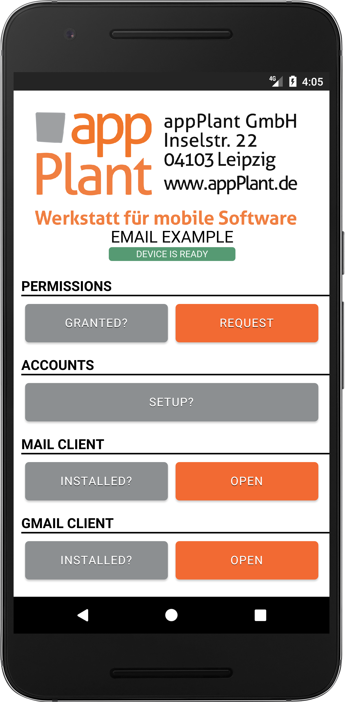
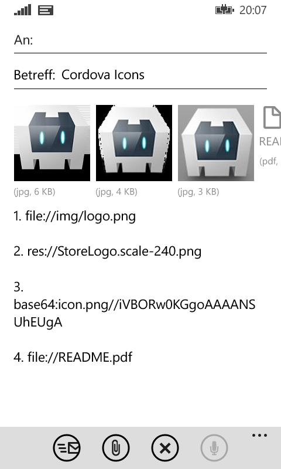

Cordova Email Plugin - Example
==============================

[Cordova][cordova] plugin to access the specific email composition API on various mobile platforms including iOS, Android and Windows Phone.

## Instructions
[Download][zip] or clone the _example_ branch and run the following command:

```bash
cordova run [ios|android|windows]
```

These will lunch the simulator or any plugged in device and start the example application as seen below in the screenshots. Its also possible to open the project with [Xcode][xcode], [Android Studio][studio] or [Visual Studio][vs].

<p align="center">
    </img>
</p>

A click on the _"Draft with attachments"_ button will present the email composition controller to send the draft and for further editing.

```javascript
cordova.plugins.email.open({
    subject: 'Cordova Icons',
    recipients: 'max@mustermann.de',
    attachments: [
        'file://img/logo.png',
        'res://icon.png',
        'base64:icon.png//iVBORw0KGgoAAAANSUhEUg...',
        'file://README.pdf'
    ]
})
```

Please read the plugin's [README][readme] for further requirements and informations.


## Screenshots

<p align="center">
    </img>
    </img>
    </img>
</p>


## License

This software is released under the [Apache 2.0 License][apache2_license].

© 2013-2016 appPlant UG, Inc. All rights reserved


[cordova]: https://cordova.apache.org
[readme]: https://github.com/katzer/cordova-plugin-email-composer/blob/master/README.md
[zip]: https://github.com/katzer/cordova-plugin-email-composer/archive/example.zip
[xcode]: https://developer.apple.com/xcode/
[studio]: https://developer.android.com/sdk/installing/studio.html
[vs]: https://www.visualstudio.com
[apache2_license]: http://opensource.org/licenses/Apache-2.0

